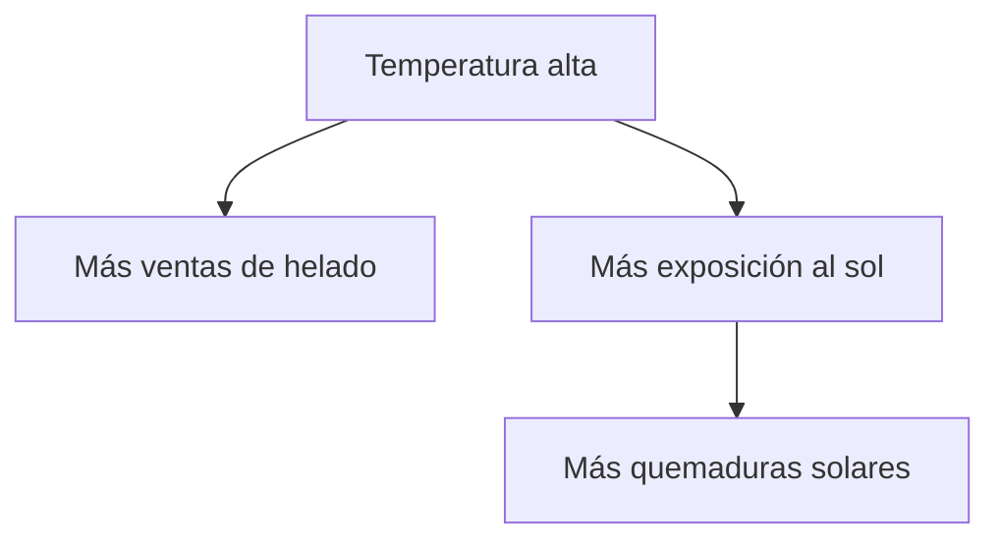
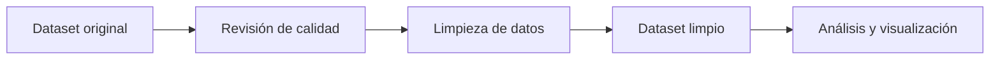

# 📊 Parte 1: Análisis Exploratorio de Datos (EDA)

## 🎯 Objetivo del documento

Este README responde las preguntas teóricas sobre el **Análisis Exploratorio de Datos (EDA)**. La idea es entender los conceptos principales antes de pasar a la práctica con Python.

---

## 🧭 Mapa general del proceso EDA


---

# 1. ¿Qué es el EDA y cuál es su propósito en el análisis de datos?

El **EDA** (*Exploratory Data Analysis*) es el proceso de **explorar, revisar, resumir y visualizar datos** antes de sacar conclusiones o crear modelos.

Su propósito principal es **entender los datos**.

Con un EDA buscamos responder preguntas como:

- ¿Qué información contiene el dataset?
- ¿Hay datos faltantes o errores?
- ¿Qué variables son importantes?
- ¿Existen patrones o relaciones entre variables?
- ¿Hay valores extraños?

Un científico de datos rara vez comienza entrenando un modelo directamente. Primero necesita conocer los datos.

### ✅ Ejemplo simple

Supongamos que una tienda tiene datos de ventas:

| Producto | Precio | Cantidad vendida | Ciudad |
|---|---:|---:|---|
| Camisa | 20 | 15 | Madrid |
| Zapatos | 60 | 4 | Valencia |
| Pantalón | 35 | 10 | Madrid |

Con un EDA podríamos descubrir:

- Qué producto se vende más.
- Qué ciudad compra más.
- Si hay precios demasiado altos o bajos.
- Si faltan datos en alguna columna.

📌 **Idea clave:** el EDA sirve para transformar una tabla desconocida en información comprensible.

---

# 2. ¿Qué tipos de datos existen en un EDA?

En un EDA podemos encontrar distintos tipos de datos. Cada tipo se analiza de forma diferente.

| Tipo de dato | Qué representa | Ejemplos |
|---|---|---|
| 🔢 Numérico | Cantidades medibles | Edad, salario, precio, temperatura |
| 🏷️ Categórico nominal | Categorías sin orden | País, color, ciudad, tipo de producto |
| 📶 Categórico ordinal | Categorías con orden | Bajo / Medio / Alto, chico / mediano / grande |
| 🔘 Binario | Solo dos valores posibles | Sí / No, 0 / 1, aprobado / desaprobado |
| 📅 Fecha / tiempo | Información temporal | Fecha de compra, hora de ingreso, año |

### ✅ Ejemplo simple

| Variable | Tipo de dato |
|---|---|
| Edad del cliente | Numérico |
| Ciudad | Categórico nominal |
| Nivel de satisfacción: bajo, medio, alto | Ordinal |
| Compró: sí/no | Binario |
| Fecha de compra | Fecha / tiempo |

📌 **Idea clave:** antes de analizar una variable, primero hay que saber qué tipo de dato es.

---

# 3. ¿Cuál es la diferencia entre análisis univariado, bivariado y multivariado?

La diferencia está en la **cantidad de variables** que se analizan.

| Tipo de análisis | Cantidad de variables | Objetivo |
|---|---:|---|
| 🔹 Univariado | 1 variable | Entender una variable por separado |
| 🔸 Bivariado | 2 variables | Analizar relación entre dos variables |
| 🔺 Multivariado | 3 o más variables | Estudiar relaciones más complejas |

### 🔹 Análisis univariado

Analiza una sola variable.

✅ Ejemplo: analizar solo la edad de los estudiantes.

```text
Edades: 18, 19, 20, 21, 22
```

Podemos calcular promedio, mínimo, máximo o hacer un histograma.

### 🔸 Análisis bivariado

Analiza dos variables al mismo tiempo.

✅ Ejemplo: analizar la relación entre **horas de estudio** y **nota obtenida**.

| Horas de estudio | Nota |
|---:|---:|
| 2 | 5 |
| 4 | 7 |
| 6 | 9 |

Podemos observar si estudiar más se relaciona con mejores notas.

### 🔺 Análisis multivariado

Analiza tres o más variables juntas.

✅ Ejemplo: analizar cómo influyen **horas de estudio**, **asistencia** y **horas de sueño** en la nota final.

📌 **Idea clave:**

```text
Univariado = una variable
Bivariado = dos variables
Multivariado = tres o más variables
```

---

# 4. ¿Qué es la estadística descriptiva?

La **estadística descriptiva** es el conjunto de técnicas que permite **resumir y describir los datos**.

Sirve para responder:

> ¿Cómo son mis datos?

Incluye medidas como:

| Medida | Qué indica | Ejemplo |
|---|---|---|
| Media | Promedio | Promedio de ventas |
| Mediana | Valor central | Edad central de un grupo |
| Moda | Valor más repetido | Producto más vendido |
| Mínimo | Valor más bajo | Menor precio |
| Máximo | Valor más alto | Mayor salario |
| Desviación estándar | Dispersión de los datos | Qué tanto varían los precios |

### ✅ Ejemplo simple

Notas de cinco estudiantes:

```text
6, 7, 7, 8, 10
```

Estadística descriptiva:

| Medida | Resultado |
|---|---:|
| Media | 7.6 |
| Mediana | 7 |
| Moda | 7 |
| Mínimo | 6 |
| Máximo | 10 |

📌 **Idea clave:** la estadística descriptiva permite obtener una primera lectura rápida del dataset.

---

# 5. ¿Qué es la limpieza de datos y qué tareas suelen incluirse?

La **limpieza de datos** es el proceso de corregir, completar o eliminar problemas dentro del dataset.

Su objetivo es trabajar con datos más confiables.

## 🧹 Tareas comunes de limpieza

| Tarea | Qué significa | Ejemplo |
|---|---|---|
| Manejo de valores nulos | Completar o eliminar datos faltantes | Edad vacía |
| Eliminación de duplicados | Quitar registros repetidos | Dos filas iguales del mismo cliente |
| Tratamiento de outliers | Revisar valores extremos | Salario de 9999999 |
| Corrección de formatos | Unificar formatos | Fechas como `01/02/2024` y `2024-02-01` |
| Normalización de datos | Llevar datos a una escala común | Precios entre 0 y 1 |
| Corrección de errores | Arreglar datos mal escritos | “Mdrid” → “Madrid” |

### ✅ Ejemplo simple

Dataset original:

| Cliente | Edad | Ciudad |
|---|---:|---|
| Ana | 25 | Madrid |
| Luis |  | Valencia |
| Ana | 25 | Madrid |
| Marta | 300 | Sevilla |

Problemas detectados:

- Luis no tiene edad.
- Ana aparece duplicada.
- Marta tiene edad 300, probablemente error.

📌 **Idea clave:** si los datos están mal, el análisis también puede estar mal.

---

# 6. ¿Qué papel juegan pandas, matplotlib y seaborn en un EDA?

Estas librerías son herramientas fundamentales para trabajar con datos en Python.

| Librería | Función principal | Para qué sirve en EDA |
|---|---|---|
| 🐼 pandas | Manipular datos | Cargar, limpiar, filtrar y resumir datasets |
| 📉 matplotlib | Crear gráficos | Hacer gráficos básicos como barras, líneas e histogramas |
| 🎨 seaborn | Crear visualizaciones estadísticas | Hacer gráficos más claros y visuales con menos código |

## 🐼 pandas

Sirve para trabajar con tablas de datos llamadas **DataFrames**.

Ejemplos de uso:

```python
import pandas as pd

df = pd.read_csv("datos.csv")
df.head()
df.describe()
df.isnull().sum()
```

## 📉 matplotlib

Sirve para crear gráficos personalizados.

```python
import matplotlib.pyplot as plt

plt.hist(df["edad"])
plt.show()
```

## 🎨 seaborn

Sirve para hacer gráficos estadísticos más atractivos y fáciles de interpretar.

```python
import seaborn as sns

sns.boxplot(data=df, x="ciudad", y="ventas")
```

📌 **Idea clave:**

```text
pandas = trabaja con datos
matplotlib = crea gráficos
seaborn = mejora gráficos estadísticos
```

---

# 7. ¿Qué es una matriz de correlación y para qué sirve en el EDA?

Una **matriz de correlación** es una tabla que muestra qué tan relacionadas están las variables numéricas entre sí.

Los valores van de **-1 a 1**:

| Valor | Interpretación |
|---:|---|
| 1 | Relación positiva perfecta |
| 0 | No hay relación lineal |
| -1 | Relación negativa perfecta |

### ✅ Ejemplo simple

| Variable | Horas de estudio | Nota | Horas de sueño |
|---|---:|---:|---:|
| Horas de estudio | 1.00 | 0.85 | 0.20 |
| Nota | 0.85 | 1.00 | 0.10 |
| Horas de sueño | 0.20 | 0.10 | 1.00 |

Interpretación:

- **Horas de estudio y nota = 0.85** → relación positiva fuerte.
- **Horas de sueño y nota = 0.10** → relación débil.

## 🌡️ Visualización tipo heatmap

| Relación | Intensidad |
|---|---|
| Horas de estudio ↔ Nota | 🟩🟩🟩 Alta |
| Horas de sueño ↔ Nota | 🟨 Baja |
| Edad ↔ Nota | ⬜ Casi nula |

Código básico:

```python
correlation_matrix = df.corr(numeric_only=True)
sns.heatmap(correlation_matrix, annot=True)
```

📌 **Idea clave:** la matriz de correlación ayuda a detectar relaciones entre variables numéricas.

---

# 8. ¿Qué son los outliers y qué métodos existen para detectarlos y tratarlos?

Los **outliers** son valores atípicos o extremos que se alejan mucho del resto de los datos.

### ✅ Ejemplo simple

```text
10, 12, 13, 15, 16, 200
```

El valor **200** es un outlier porque está muy lejos de los demás valores.

## 🔍 Métodos para detectar outliers

| Método | Cómo ayuda |
|---|---|
| Boxplot | Muestra puntos alejados de la caja |
| IQR | Detecta valores fuera del rango intercuartílico |
| Z-score | Mide cuántas desviaciones estándar se aleja un dato |
| Histograma | Permite ver valores aislados visualmente |
| Scatter plot | Detecta puntos alejados en relación con otra variable |

### 📦 Método IQR

El IQR se calcula así:

```text
IQR = Q3 - Q1
```

Se consideran outliers los valores:

```text
Menores que Q1 - 1.5 × IQR
Mayores que Q3 + 1.5 × IQR
```

## 🛠️ Formas de tratar outliers

| Tratamiento | Cuándo usarlo |
|---|---|
| Mantenerlos | Si son datos reales e importantes |
| Eliminarlos | Si son errores claros |
| Reemplazarlos | Si distorsionan demasiado el análisis |
| Transformarlos | Si se quiere reducir su impacto, por ejemplo usando logaritmos |
| Analizarlos por separado | Si representan casos especiales |

📌 **Idea clave:** no todos los outliers son errores. Primero se investigan y después se decide qué hacer.

---

# 9. ¿Qué es hypothesis testing y para qué sirve en el EDA?

El **hypothesis testing** o **prueba de hipótesis** es un método estadístico que permite comprobar si una idea sobre los datos tiene evidencia suficiente.

Sirve para responder:

> ¿Este patrón parece real o puede deberse al azar?

## 🧪 Partes principales

| Concepto | Significado |
|---|---|
| Hipótesis nula (H₀) | Afirma que no hay diferencia o relación |
| Hipótesis alternativa (H₁) | Afirma que sí hay diferencia o relación |
| p-value | Indica si la evidencia es suficiente para rechazar H₀ |

### ✅ Ejemplo simple

Queremos saber si los estudiantes que estudian más de 5 horas obtienen mejores notas.

- **H₀:** estudiar más de 5 horas no cambia la nota promedio.
- **H₁:** estudiar más de 5 horas sí cambia la nota promedio.

Si el resultado estadístico muestra evidencia suficiente, podemos rechazar H₀ y considerar que hay una diferencia significativa.

## 📌 ¿Para qué sirve en EDA?

- Validar patrones observados en gráficos.
- Comparar grupos.
- Confirmar si una diferencia es significativa.
- Evitar conclusiones basadas solo en intuición visual.

### Ejemplo aplicado

Si un gráfico muestra que los clientes jóvenes compran más que los adultos, una prueba de hipótesis ayuda a comprobar si esa diferencia es estadísticamente significativa o si podría deberse al azar.

📌 **Idea clave:** hypothesis testing permite pasar de “parece que hay una diferencia” a “hay evidencia estadística para sostenerlo”.

---

# ✅ Resumen visual rápido

| Tema | Idea central |
|---|---|
| EDA | Entender los datos |
| Tipos de datos | Identificar cómo analizar cada variable |
| Univariado | Una variable |
| Bivariado | Dos variables |
| Multivariado | Tres o más variables |
| Estadística descriptiva | Resumir datos |
| Limpieza de datos | Corregir problemas del dataset |
| pandas | Manipular datos |
| matplotlib | Crear gráficos |
| seaborn | Crear gráficos estadísticos |
| Matriz de correlación | Ver relaciones entre variables numéricas |
| Outliers | Detectar valores atípicos |
| Hypothesis testing | Validar patrones con estadística |

---

# 🧠 Checklist para estudiar antes de la práctica

- [ ] Entender qué es un EDA.
- [ ] Reconocer tipos de datos.
- [ ] Diferenciar análisis univariado, bivariado y multivariado.
- [ ] Interpretar medidas descriptivas.
- [ ] Saber qué problemas se corrigen en limpieza de datos.
- [ ] Conocer el uso de pandas, matplotlib y seaborn.
- [ ] Interpretar una matriz de correlación.
- [ ] Detectar y tratar outliers.
- [ ] Comprender para qué sirve una prueba de hipótesis.


# 📎 Anexo: Conceptos adicionales para entender un EDA

Este anexo complementa la parte teórica del Análisis Exploratorio de Datos (EDA). Incluye conceptos que ayudan a conectar la teoría con la práctica y a interpretar mejor los resultados obtenidos durante el análisis.

---

## 1. Variable objetivo 🎯

La **variable objetivo** es la variable principal que se quiere analizar, explicar o predecir.

En un EDA, identificar la variable objetivo ayuda a orientar el análisis. No todas las columnas tienen la misma importancia: algunas sirven para describir el contexto y otras pueden estar relacionadas directamente con el resultado que se quiere estudiar.

### Ejemplo simple

En un dataset de una tienda online, la variable objetivo podría ser:

```text
Compra_realizada
```

Y otras variables podrían ser:

| Variable | Posible utilidad |
|---|---|
| Edad | Analizar si influye en la compra |
| País | Comparar comportamiento por región |
| Tiempo_en_página | Ver si más tiempo aumenta la probabilidad de compra |
| Dispositivo | Analizar diferencias entre móvil y computadora |

### Idea clave

> La variable objetivo responde a la pregunta principal del análisis.

---

## 2. Calidad de datos 🧹

La **calidad de datos** se refiere al nivel de confiabilidad, coherencia y completitud de los datos.

Antes de sacar conclusiones, es necesario revisar si los datos tienen errores. Un análisis realizado sobre datos incorrectos puede producir conclusiones equivocadas.

### Problemas comunes de calidad de datos

| Problema | Ejemplo | Posible solución |
|---|---|---|
| Valores nulos | Edad vacía | Imputar o eliminar registros |
| Duplicados | Cliente repetido dos veces | Eliminar duplicados |
| Errores de formato | Fecha escrita como texto | Convertir al formato correcto |
| Valores imposibles | Edad = -10 | Corregir o eliminar |
| Outliers | Salario = 9999999 | Revisar si es error o caso real |
| Inconsistencias | “Femenino”, “fem”, “F” | Normalizar categorías |

### Ejemplo simple

```text
Edad: 22, 25, 30, -5, 28
```

El valor **-5** no tiene sentido como edad. En un EDA, este dato debe revisarse antes de continuar.

### Idea clave

> Limpiar los datos no es un paso opcional: es necesario para que el análisis sea confiable.

---

## 3. Correlación no implica causalidad ⚠️

La **correlación** indica que dos variables se mueven de manera relacionada, pero no demuestra que una cause la otra.

Es decir, aunque dos variables tengan una relación fuerte, no significa automáticamente que una sea la causa de la otra.

### Ejemplo simple

Supongamos que en verano aumentan dos cosas:

```text
Ventas de helado 🍦
Quemaduras solares ☀️
```

Podría existir una correlación entre ambas, pero eso no significa que comer helado cause quemaduras solares.

La causa real puede ser una tercera variable:



### Idea clave

> La correlación ayuda a detectar relaciones, pero se necesita más análisis para hablar de causalidad.

---

## 4. Feature Engineering 🛠️

El **feature engineering** consiste en crear nuevas variables a partir de las variables existentes.

Su objetivo es mejorar el análisis y obtener información más útil a partir de los datos originales.

### Ejemplo 1: crear edad

Si tenemos una columna:

```text
Fecha_de_nacimiento
```

Podemos crear una nueva variable:

```text
Edad
```

Esto facilita el análisis porque la edad es más fácil de interpretar que una fecha de nacimiento.

### Ejemplo 2: crear ingresos

Si tenemos:

```text
Precio
Cantidad_vendida
```

Podemos crear:

```text
Ingresos = Precio × Cantidad_vendida
```

### Ejemplo 3: agrupar edades

A partir de una variable numérica como:

```text
Edad
```

Podemos crear una variable categórica:

| Edad | Grupo_etario |
|---|---|
| 8 | Niño |
| 17 | Adolescente |
| 30 | Adulto |
| 70 | Adulto mayor |

### Idea clave

> Feature engineering permite transformar datos simples en variables más útiles para el análisis.

---

## 5. Dataset limpio vs. dataset original 📊

Durante un EDA, normalmente se parte de un dataset original y luego se obtiene una versión más limpia.



### Diferencia principal

| Dataset original | Dataset limpio |
|---|---|
| Puede tener errores | Tiene menos errores |
| Puede tener valores faltantes | Valores faltantes tratados |
| Puede tener duplicados | Duplicados eliminados |
| Puede tener formatos inconsistentes | Formatos corregidos |

### Idea clave

> El dataset limpio es la base para obtener conclusiones más confiables.

---

## 6. Preguntas guía para un buen EDA 🔍

Un EDA puede orientarse con preguntas como:

- ¿Cuántas filas y columnas tiene el dataset?
- ¿Qué significa cada variable?
- ¿Qué tipo de dato tiene cada columna?
- ¿Hay valores faltantes?
- ¿Hay registros duplicados?
- ¿Existen valores extremos?
- ¿Qué variables parecen estar relacionadas?
- ¿Qué patrones aparecen en los gráficos?
- ¿Qué conclusiones pueden extraerse con evidencia?

---

## Checklist del anexo ✅

- [x] Identificar la variable objetivo
- [x] Revisar la calidad de los datos
- [x] Entender que correlación no implica causalidad
- [x] Crear nuevas variables cuando sea útil
- [x] Diferenciar dataset original y dataset limpio
- [x] Formular preguntas que guíen el análisis

---

## Resumen visual 🧠

```text
EDA = entender + limpiar + analizar + visualizar + concluir
```

| Concepto | Para qué sirve |
|---|---|
| Variable objetivo | Define el foco del análisis |
| Calidad de datos | Asegura que los datos sean confiables |
| Correlación | Mide relaciones entre variables |
| Causalidad | Explica si una variable provoca cambios en otra |
| Feature engineering | Crea nuevas variables útiles |
| Dataset limpio | Permite analizar con mayor precisión |


